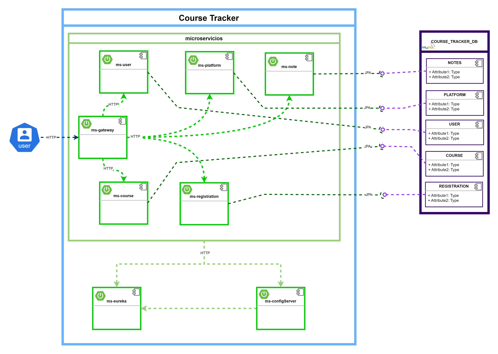

# Course Tracker

Proyecto que permite llevar el control (tipo agenda) de los cursos en los que estoy
inscrito, de diversas plataformas en línea y tomar apuntes de cada uno de ellos,
con el fin de recordar los temas más importantes, con el método zettelkasten que 
es una técnica de toma de apuntes.

## Arquitectura

### Tecnologías del proyecto
- Java 17
- Spring Boot 3.2.2
- Maven
- Eureka Server (Spring Cloud)
- Service Discovery (Spring Cloud)
- Gateway (Spring Cloud)
- Config Server (Spring Cloud)
- Config Client (Spring Cloud)
- Feign (Spring Cloud)
- Actuator (Spring Cloud)
- Spring DevTools
- Spring Configuration Processor
- MySQL
- JPA
- Hibernate
- Lombok

### Diagrama de arquitectura

